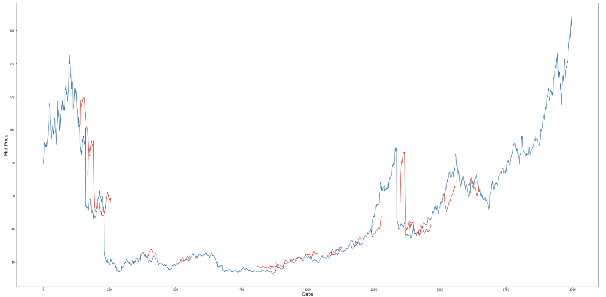

# Stocks

Designed a Recurrrent Neural Network (RNN) that uses LSTM (Long Short Term Memory) to learn the pattern from the past stock prices, and predict the future prices. The project was inspired from one of the siimilar projects "Music Generation with Tensorflow" at MIT deep learning bootcamp.

Different hyperparameters are used to fine-tune the model like no. of timesteps to learn at a time, no. of timesteps we want to predict into the future,
batch-size, no. of iterations, learning rate and many more. Matplotlib is used for visualization of data.

---
Stock prediction of American Airlines (AAL) at different timesteps. Red line indicates the prediction.

